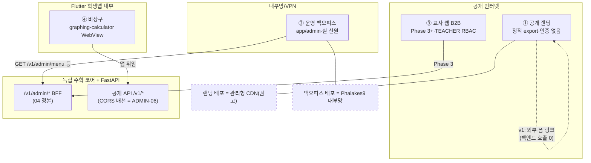

# 웹 전략 통합 — 자산 지도·공개 랜딩·배치 (Web Strategy)

> **질문**: WhyMath의 웹은 무엇이고(자산 지도), 무엇부터 만들고(랜딩 vs 백오피스), 어디에 어떻게 배치(배포)하는가?
>
> **한 줄 답**: 웹 자산은 4종(공개 랜딩·운영 백오피스·교사 웹 B2B·국소 비상구)이며 전부 **슬라이스 89 ③ "별도 웹" 정의 안**이다(정제·역전 아님). 스택은 확정 그대로 **React 19 + Next.js 15 단일 코드베이스**(`src/web/webapp/`) — 배포·인증 도메인만 분리한다. 배치는 **노출 프로파일 3분**: 랜딩=공개 정적(관리형 CDN 권고), 백오피스=내부망/VPN(Phaiakes9), 교사 웹=Phase 3 시점 재평가. **최종 배포 대상 확정은 Kiki**(§4는 비교·권고까지 — MEMORY 2026-08-10 결정 로그 참조).

---

## §1. 웹 자산 지도 — 무엇이 웹이고 무엇이 아닌가 (슬89 정합)

| # | 자산 | 대상 사용자 | 노출 프로파일 | 인증 | 시점 | 정본 |
|---|---|---|---|---|---|---|
| ① | **공개 랜딩** (소개·SEO·베타 모집) | 학부모·학생·언론·검색 유입 | 공개 인터넷 (정적) | 없음 | v1.0 MVP 마케팅 동기 | 본 문서 §3 |
| ② | **운영 백오피스** | 내부 운영자 | **내부망/VPN 한정** | 실 신원 (SSO/관리자 계정·demo 토큰 금지) | Phase A/B | [04_admin_console_architecture](../design/ui/04_admin_console_architecture.md) |
| ③ | **교사 웹** (B2B·학원·학교 RBAC 변형) | 교사·학원·학교 | 공개 (인증 필수) | `TEACHER` RBAC (Phase 3 선결) | Phase 3+ | 04 §7 Phase C · [07_community](07_community.md) |
| ④ | **국소 비상구** (그래프 계산기 등) | 학생 (WebView 임베드) | 앱 내부 | 앱 위임 | 기존 | `src/web/graphing-calculator/` — **불가침·이 문서 범위 밖** |

**"학생 경험 아님" 원칙과의 정합 논리**: 슬라이스 89는 학생 *학습 경험*을 Flutter 단일로 못박았다. 랜딩은 학습 경험이 아니라 **유입·소개 표면**이다 — 학습 기능 0·수학 로직 0(ARCH-10 게이트 대상). 슬89 ③의 목적 문구("교사 대시보드·**SEO·검색유입·공유**")가 이미 랜딩의 좌석이므로, 본 문서는 그 목적의 첫 실체화이지 정의 확장이 아니다. 4층 구조(코어/학생 Flutter/별도 웹/비상구) 불변 — 새 층 아님.



---

## §2. 모노레포 배치·코드 공유

```
src/web/
├── graphing-calculator/   # 슬89 ④ 비상구 (Vite SPA) — 불가침·별도 웹과 무관
└── webapp/                # 신설 (WEB-01) — Next.js 15 단일 앱 (React 19·App Router)
    └── app/
        ├── (public)/      # ① 공개 랜딩 라우트 그룹 — 정적 export 대상
        └── admin/         # ② 백오피스 라우트 그룹 (ADMIN-06) — 내부망 배포 전용
```

**단일 앱 vs 별도 앱 2개**:

| | 단일 앱 + 라우트 그룹 (권고) | 별도 앱 2개 |
|---|---|---|
| 04 §1 원칙 정합 | ◎ "스택·컴포넌트 공유, 배포·인증 도메인만 분리" 그대로 | △ 컴포넌트 공유에 워크스페이스 패키지 계층 추가 필요 |
| 유지보수 | 의존성·디자인 토큰·CI 1곳 | 이원화 (드리프트 리스크 — "유지보수 지옥" 방어 역행) |
| 노출 분리 | 배포 산출물 분리로 달성 (아래 요건) | 저장소 구조 자체로 자명 |

→ **단일 앱 권고**. 단, **배포 요건**: 공개(랜딩) 산출물에 admin 번들이 포함되지 않아야 한다 — 빌드 분리 방식(env 기반 라우트 제외·다중 빌드 타깃 등)은 WEB-01·ADMIN-06 구현에서 결정하되, "공개 빌드에 admin 코드 0"을 검증 가능한 acceptance로 취급한다.

**분리 방식 확정 (ADMIN-06 · 2026-09-22)**: **타깃별 `pageExtensions`**를 택했다. Next가 라우트 파일(`page`·`layout`·`robots`·`sitemap` …)을 *파일명 확장자*로 식별한다는 성질을 그대로 써서, admin 라우트 파일에만 `.admin.tsx` 접미를 주고 `WHYMATH_WEB_TARGET`으로 목록을 바꾼다 — 공개 타깃 `["tsx","ts"]` / admin 타깃 `["admin.tsx","admin.ts"]`. 실측(Next 15.5.25): 공개 빌드 라우트에 `/admin` 0건, admin 빌드 라우트에 `/` 0건으로 **양방향으로 갈린다**. 대안(별도 앱 2개)을 택하지 않은 이유는 위 표 그대로이고, env 기반 런타임 라우트 제외는 *산출물*이 아니라 *동작*만 막으므로 배포 요건을 만족하지 못한다.

검증은 **소스 축과 산출물 축이 나뉜다**: 접미 규약·역방향 import 부재는 `tests/infra/test_webapp_admin_shell_governance.py`와 `test_webapp_landing_governance.py`가 정적으로, 공개 `out/`의 `/admin` 경로 0건과 **번들 표식 0건**은 CI `webapp` 잡이 exit code로 본다. 둘 다 필요하다 — 주입 실측(2026-09-22)에서 ⓐ접미 제거는 경로·표식 양쪽에 나타났지만 ⓑ공개 클라이언트 소스가 admin을 import하는 누출은 **표식 검사만** 잡았다(경로는 끝까지 생기지 않는다). 두 경우 모두 `next build`는 exit 0이었다.

**기존 장치 재사용**:
- **ARCH-10** (done): L5 클라이언트 무-수학로직 CI 게이트가 `src/web/`에 기적용 — 표현≠의미는 웹도 예외 없음(04 §2 원칙1).
- **CI**: 기존 `web` 잡은 `src/web/graphing-calculator/` 전용(paths 필터) — `webapp/` lint+build 잡 신설은 WEB-01 acceptance의 집행 별항("존재가 아니라 실행 확인").
- **도메인 소유**: `src/web/` = web 도메인([parallel_sessions](../standards/parallel_sessions.md)) — hot file 규칙(package-lock 재생성 제한) 승계.

---

## §3. 공개 랜딩 설계 (전 저장소 최초 정본)

### §3.1 IA — 단일 페이지 + `/beta`

| 섹션 | 내용 | 원천 |
|---|---|---|
| 히어로 | 슬로건 **"답이 아닌, 이유를 묻는 수학"** / "The math that asks why." | CLAUDE.md 브랜드 |
| 문제의식 | 사교육 격차 해소 미션 | PRD 특성 #87 |
| 방법론 소개 | 답 미루기·Polya 4단계·메타인지 — **소개만, 기능 데모 아님** | 04·L4 정본 |
| 대상 | 페르소나 A(일반고 고3) 우선 메시지 + 학부모·교사 안내 | PRD §3 |
| 베타 CTA | 강남 어머니 100명 베타(#94)·일반고 학원 5곳 무료(PMF) | PRD v1.0 마케팅 |
| 법정 표시 푸터 | 사업자 정보·약관·개인정보처리방침 링크 자리 | 법무 산출물 연계 |

### §3.2 베타 신청 데이터 경로 — Phase 1 = 외부 폼

- **v1**: 외부 폼 **링크**(백엔드 무변경·CORS 불요·수집 최소화). 단 외부 폼도 **개인정보 처리위탁 고지** 대상 — §3.4 변호사 게이트 항목에 포함.
- **자체 폼**(자사 백엔드 직송·제3자 저장 회피)은 법무 검토 후 후속 — 그 시점의 선결은 CORS(ADMIN-06에서 배선되는 것을 재사용)·rate limit.

### §3.3 SEO

정적 export + 메타/OG + `sitemap.xml`/`robots.txt` + 구조화 데이터. 한국 검색 등록(네이버 서치어드바이저 포함). 콘텐츠 마케팅(블로그)은 범위 밖 후속 — 필요 시 별도 태스크로.

### §3.4 법적 게이트 — 변호사 검토 (기계 대체 금지)

| 항목 | 내용 | 근거 |
|---|---|---|
| 광고·마케팅 규제 | **RCT 검증 전 "성적이 오른다" 류 효과 단정 금지**·비교 광고 자문 | [regulatory_checklist](../legal/regulatory_checklist.md) §4 |
| 웹접근성 | 지능정보화기본법 §46은 문언상 *웹사이트* 중심 — 웹을 만들면 적용 범위가 실제로 변동(법률 판단 사항) | [service_operations_gap_review](service_operations_gap_review.md) |
| 개인정보 | 베타 폼 수집 최소화·처리위탁 고지·처리방침 문구 | PIPA·CLAUDE.md 금기 |

**카피 가이드(1줄 규칙)**: 효과 단정·비교 우위 단정 문구를 랜딩 어디에도 쓰지 않는다 — CLAUDE.md AI·신뢰 금기("확실하지 않을 때 자신 있게 말함" 패턴 금지)의 마케팅 축 적용. gates 대장 등재 완료(2026-09-22) = `G-web01-landing-legal-review`, WEB-02 `requires_gates`에 부착. 코드 쪽 카피 가드는 `tests/infra/test_webapp_landing_governance.py` 계약 ⑤이며 **보조 탐지기**다 — 문자열 열거는 표현 변형에서 뚫리므로 효과 단정 여부의 최종 판정은 사람(변호사)이 한다.

### §3.5 콘텐츠 원천

`prd_v1.2.md`(피치·마케팅) · `market_positioning.md` · `reclaimed_time_positioning_v1.md`("회수된 시간" 축).

---

## §4. 배치(배포) 비교·권고

**실측 전제 (2026-08-10)**: TLS 종단·리버스 프록시·GCP/AWS 대상 **미프로비저닝** — `docker-compose.prod.yml`은 Phaiakes9 단일 호스트 전제이고 `deploy.yml`은 실 호스트 실행 이력 0의 골격이다(정본: [deployment_cd_runbook](deployment_cd_runbook.md) §8). ~~백엔드에 **CORSMiddleware 0건**~~ — **정정(2026-09-11 SEC-26)**: CORSMiddleware는 `create_app`에 상시 등록됐고 `WHYMATH_CORS_ALLOWED_ORIGINS`(기본 빈 값)가 deny-by-default를 유지한다. 즉 아래 권고 4의 "선결 배선"은 *미들웨어 부재*가 아니라 **origin 허용 목록의 설정**만 남은 상태이고, 그 집행 지점(브라우저의 첫 실호출)이 ADMIN-06에서 착지했다.

**비교표** (평가 축: 비용 / 운영 부담 / 보안·내부망 요건 / 한국 리전 지연 / 미성년 프라이버시 / TLS·CDN 자동화):

| 자산 ＼ 대상 | Phaiakes9 도커 | GCP/AWS | 관리형 정적 호스팅 (Vercel·Cloudflare Pages 류) |
|---|---|---|---|
| ① 랜딩 (공개 정적) | △ 개발 프리뷰만 — 가정 호스트의 공개 노출·TLS·가용성 부담 | ○ 정적 버킷+CDN·서울 리전·현행 프로덕션 방침 정합·운영 부담 중간 | ◎ **권고 1순위** — 정적 무료 티어·TLS/CDN 자동·운영 부담 ~0. 개인정보 미취급 정적 자산이라 위탁 쟁점 최소 |
| ② 백오피스 (내부망) | ◎ **권고** — compose 확장+내부망·04 §5 정합·클라우드 불요 | △ 사설 서브넷+VPN — Phase B 후 재평가 | ✗ 부적합 — 공개 URL 전제, 04 §5(공개 인터넷 미노출) 위반 |
| ③ 교사 웹 (B2B 공개) | ✗ 가용성·SLA 부적합 | ○ 후보 | ○ 후보 |

**권고** (최종 확정 = Kiki):

1. **랜딩 = 정적 export → 관리형 CDN 1순위, GCP/AWS 정적 버킷+CDN 2순위.** 신규 외부 서비스 채택이므로 **Kiki 확정 + MEMORY 결정 로그가 선결**이다(WEB-02 acceptance가 인코딩). 계약·개인정보 위탁 판단은 Kiki+법무 사안 — 본 문서는 결정을 대체하지 않는다.
2. **백오피스 = Phaiakes9 내부망.** 공개 금지 원칙(04 §5)상 클라우드가 필요 없다. prod compose 확장·리버스 프록시 배선은 Phase B 시점 별도 태스크(§6 미등재 제안).
3. **교사 웹 = Phase 3 시점 재평가.** 트래픽·B2B SLA가 실체화되기 전에 확정하지 않는 것 자체가 권고다.
4. **CORS 선결 시점 = ADMIN-06**(브라우저가 API를 실제 호출하는 첫 지점). origin 허용 목록 **fail-closed**(기본 빈 목록=전면 차단·와일드카드+credentials 조합 불가). 집행 지점 없는 선행 배선은 만들지 않는다("정본화≠집행" 사고 패턴의 역형 방지).
   - **착지(ADMIN-06)**: 미들웨어·설정·부팅 거부는 SEC-26이 먼저 놓았고, ADMIN-06이 그 위에 *집행 지점*을 얹었다 — 백오피스 셸이 실제로 부르는 `/v1/admin/menu`에 대해 `Authorization` 프리플라이트가 origin에 따라 갈리는 것을 `tests/backend/test_cors_policy_freeze.py::TestAdminMenuPreflightForWebShell`이 동결한다(allow-origin뿐 아니라 **allow-headers까지** 맞아야 실제로 열린다). 남은 것은 값 설정이며, 그것은 배포 결정(§4 권고 2)에 속한다.

---

## §5. 단계 로드맵 (기존 Phase 정합 — 새 Phase 없음)

| 시점 | ① 랜딩 트랙 | ② 백오피스 트랙 | ③ 교사 웹 트랙 |
|---|---|---|---|
| 지금 (S4) | 본 문서·백로그 등재만 (코드 0) | 동일 | — |
| v1.0 MVP 베타 모집 전 | WEB-01 → (Kiki 배포 확정) → WEB-02 | ADMIN-04 → ADMIN-05 (04 §7 Phase A read) | — |
| Phase B | — | ADMIN-06 → ADMIN-07 (검수 쓰기 개시) | — |
| Phase 3+ | — | — | 04 §7 Phase C — `TEACHER` RBAC 선결·**태스크 미등재**(dead code 금지) |

---

## §6. 백로그 (등재 완료 — 2026-08-10·전건 `backlog.py add` 경유)

| ID | 요지 | layer | depends |
|---|---|---|---|
| `WEB-01-landing-static-v1` | 공개 랜딩 v1 (Next.js 15 정적 export·외부 폼 CTA·CI 잡 신설·변호사 게이트 선결) | web | — |
| `WEB-02-landing-deploy` | 랜딩 배포 배선 (Kiki 확정 후 집행·확정 전 프로비저닝 금지) | infra | WEB-01 |
| `ADMIN-04-module-registry` | 모듈 레지스트리 + `GET /v1/admin/menu` (04 §2 원칙7) | backend | — |
| `ADMIN-05-bff-readonly` | Admin BFF Phase A read-only·마스킹·감사 | backend | ADMIN-04 |
| `ADMIN-06-admin-web-shell` | 백오피스 셸 (내비=menu API·CORS 배선·내부망 한정) — **착지 2026-09-22** | web | ADMIN-04 · WEB-01 |
| `ADMIN-07-review-ui` | 검수 큐 UI (Phase B·상태 전이+불변 감사) | web | ADMIN-05 · ADMIN-06 |

04 §8의 제안 4건(ADMIN-MODULE-REGISTRY·ADMIN-BFF·ADMIN-REVIEW-UI·ADMIN-WEB)이 위 `ADMIN-04~07`로 번호를 받아 등재됐다.

**미등재로 남긴 것(의도적)**: ⓐ 교사 웹 착수 — `TEACHER` role 부재(dead code 금지·04 §2 원칙3) ⓑ 백오피스 prod 내부망 배선(리버스 프록시 포함) — Phase B 시점.

**ⓒ 해소(2026-09-22·WEB-01 착지)**: 변호사 게이트는 HARN-18(`gates add` CLI) 착지 후 `G-web01-landing-legal-review`로 등재됐고 **WEB-02의 `requires_gates`에 부착**됐다 — 등재만 하고 부착하지 않으면 selector가 배포 태스크를 착수 후보로 계산한다(선행을 산문에만 적는 형태). 함께 등재: `G-web01-required-check-register`(신규 CI 잡을 라이브 룰셋의 required check로 올리는 UI 조작 — 문서 목록만 고치면 드리프트 탐지기가 상시 red가 된다).

---

**버전**: 1.0 | **작성**: 2026-08-10 | **교차링크**: [00_overview](00_overview.md) · [04_admin_console_architecture](../design/ui/04_admin_console_architecture.md) · [02_student_ui_master_plan](../design/ui/02_student_ui_master_plan.md) · [07_community](07_community.md) · [deployment_cd_runbook](deployment_cd_runbook.md) · [regulatory_checklist](../legal/regulatory_checklist.md) · MEMORY 2026-08-10 결정 로그
