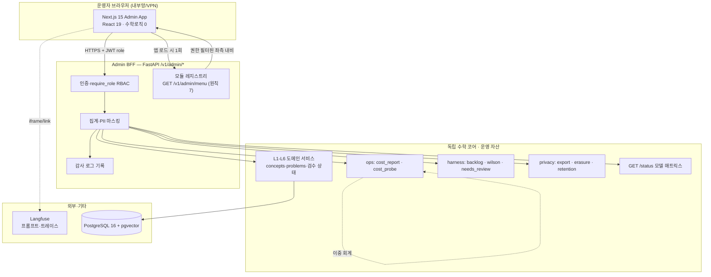

# 04. 관리 UI 아키텍처

> **질문**: 이 관리 UI의 아키텍처는?
>
> **한 줄 답**: **Next.js 15 프런트 + FastAPI `/v1/admin/*` BFF 계층**, 그 앞에 **RBAC**(v0 2값 착지·관리 콘솔 전용 확장은 선결). 좌측 내비는 **선언적 모듈 레지스트리**에서 자동 파생(§2 원칙7 — "모든 가능 메뉴 자동 등록", 2026-08-02 Kiki 요청). 백오피스도 표현≠의미를 지켜 수학 로직을 담지 않고 독립 코어 API만 소비하며, 모든 관리 액션은 불변 감사 로그를 남긴다.

---

## §1. 스택

| 계층 | 기술 | 비고 |
|---|---|---|
| 프런트 | **React 19 + Next.js 15 (App Router)** | 이미 확정된 별도 웹 스택(`CLAUDE.md` 스택 표·교사 대시보드용). 운영 백오피스와 교사 웹이 **스택·컴포넌트 공유**, 배포·인증 도메인만 분리(내부 vs B2B). |
| BFF | FastAPI `/v1/admin/*` 라우터 | 기존 앱(`app.py`)에 신설. 인증·집계·감사 동반. |
| 코어 | 기존 L1-L6 서비스 | 재사용(수학 로직 미이관). |
| 데이터 | PostgreSQL 16 + pgvector | 기존. Neo4j/ClickHouse는 미배선(그래프=PG+`graph.json`). |
| 관측 임베드 | Langfuse | 재구현 없이 링크/임베드. |

---

## §2. 아키텍처 원칙

### 원칙 1 — 표현 ≠ 의미 (백오피스도 예외 없음)
관리 UI도 View Layer. 동치 판정·검산·난이도 추정은 코어(SymPy·L2·L3)가 하고, 콘솔은 *결과를 표시·상태를 전이*만 한다. 수학 로직을 admin 프런트에 넣지 않는다.

### 원칙 2 — Admin BFF 계층
기존 FastAPI에 `/v1/admin/*` 라우터를 신설한다. 목적:
- 운영 엔드포인트(모델 상태·비용 집계·검수 큐·사용자 조회)를 **인증·권한·감사와 함께** 노출.
- **기존 무인증 콘텐츠 CRUD에 RBAC 부착** — `api/concepts.py`·`api/problems.py`의 생성/수정/삭제는 현재 인증 의존성이 없다(실측). BFF가 이들을 `require_role`로 감싸거나, admin 전용 래퍼로 재노출한다.
- 집계·마스킹은 BFF에서 수행(프런트에 원자료 미노출 — 미성년 PII 최소화).

### 원칙 3 — RBAC (v0 착지 · 관리 콘솔 전용 확장은 후속 🔴)

**현재 상태(2026-08-02 실측 갱신 — `SEC-07` 완료)**: `Role` enum(`schema/enums.py`)에 **`STUDENT`·`CONTENT_ADMIN` 2값**이 착지했고, `UserProfile.role` 컬럼(기본값 `STUDENT`)·`require_role` 의존성이 콘텐츠 CRUD 6라우터+`/v1/generate`에 부착돼 **무인증 CUD는 봉인됐다**. 단, **관리 콘솔 자체는 아직 이 role을 소비하지 않는다** — Admin BFF(`/v1/admin/*`)가 없으므로 `CONTENT_ADMIN`이 실제로 쓰이는 곳은 콘텐츠 API뿐이고, 운영 백오피스 화면·§2 원칙7 모듈 레지스트리의 권한 필터·2차원 항목별 인가는 여전히 🔴다.

**의도적 축소(재확인)**: `PARENT`·`TEACHER`·`SCHOOL_ADMIN`·`SYSTEM_ADMIN`은 아직 열지 않는다(좌석 없는 역할은 dead code 금지). `SYSTEM_ADMIN`은 `CONTENT_ADMIN`과 구분할 권한 항목(예: 사용자 삭제·플래그 오버라이드처럼 검수자 권한을 넘는 액션)이 실제로 생길 때 연다(역할 추가는 마이그레이션 1줄이고, 잘못 만든 역할을 걷어내는 비용이 더 크다). 근거·발화조건: `docs/architecture/account_security_gap_review.md` D1·§5-②.

**남은 선결 구현**:
1. Admin BFF(`/v1/admin/*`)가 기존 `require_role(Role.CONTENT_ADMIN)`을 재사용(신규 enum 불요 — v0 2값으로 Phase A/B 커버 가능, `SYSTEM_ADMIN`은 Phase B 후반 필요 시 추가).
2. **2차원 RBAC 매트릭스**(`backend-engineer.md:39` 방향): *역할 × 데이터 항목*. 예 — "교사는 학급 집계는 보되 개별 학생 PII는 못 본다", "부모는 자기 자녀의 *동의된 항목*만". 단순 역할 게이트를 넘어 항목 단위 인가. (§2 원칙7의 모듈 레지스트리 `required_roles`는 이 매트릭스의 **모듈 단위** 부분집합이고, 필드/항목 단위 인가는 별도 구현.)

### 원칙 4 — 감사 로그(불변)
모든 관리 액션(검수 승인/반려·플래그 변경·삭제·데이터 반출)을 **불변 기록**한다. 기존 자산 재사용: `db/models/audit.py`(삭제 감사)·`backlog/events.ndjson`(하네스 감사). 감사 없는 쓰기 액션 금지.

### 원칙 5 — 외부 도구 임베드 (재구현 금지)
- **Langfuse**(프롬프트 버전·LLM 트레이스): 콘솔은 링크/iframe 임베드. 프롬프트 편집은 Langfuse에서.
- **빌드 하네스**(`backlog.py` 산출·게이트 대장): 콘솔은 결과를 *read*. 상태 변경은 정규 CLI 경로 호출(손편집 금지·[03 §5](03_admin_console_plan.md)).

### 원칙 6 — 측정치 이중 회계
핵심 판정치(로컬 비율·비용·게이트 통과율)는 SaaS(Langfuse)뿐 아니라 **인프로세스**(`ops/cost_probe`)에서도 산출한다. Langfuse가 죽으면 콘솔은 **"측정 실패"를 명시**해야지 "0건 통과"로 위장하면 안 된다(`CLAUDE.md` AI·신뢰 금기).

### 원칙 7 — 모듈 자동 등록(Auto-Registration) — 신설 (2026-08-02, Kiki 요청 "모든 가능 메뉴 자동 등록")

**문제**: [03 §4](03_admin_console_plan.md)의 좌측 내비 트리·[03 §5](03_admin_console_plan.md)의 22모듈 매핑 표는 지금 **손으로 유지보수하는 마크다운**이다. 실제 관리 UI가 만들어지면, 새 관리 기능이 생길 때마다 ①좌측 내비 컴포넌트 ②라우트 가드(`require_role`) ③이 설계 문서까지 세 곳을 사람이 각각 손으로 맞춰야 한다 — 하나라도 빠뜨리면 "코드엔 있는데 메뉴엔 없음"(발견 안 됨) 또는 "메뉴엔 있는데 가드가 없음"(무인가 노출) 사고가 난다.

**해법 — 선언적 모듈 레지스트리(단일 진실 원천)**: 관리 기능을 만들 때 개발자는 **레지스트리 엔트리 하나만 추가**한다. 좌측 내비·권한 게이트·(궁극적으로는) 문서 표까지 전부 그 한 곳에서 파생된다 — "자동 등록"의 실체는 *발견 로직*이 아니라 *중복 유지보수 제거*다(모듈이 레지스트리에 있으면 메뉴 등록을 잊을 수 없는 구조).

**모듈 매니페스트 스키마** (Admin BFF 쪽 — `admin/module_registry.py`, 신설 제안):
```python
class AdminModuleStatus(str, Enum):
    LIVE = "live"        # 🟢 데이터+UI 모두 실동작
    PARTIAL = "partial"  # 🟡 데이터/엔진만 있고 UI 일부
    PLANNED = "planned"  # 🔴 계획만(자산 없음) — 메뉴엔 노출하되 비활성 표시

class AdminModule(BaseModel):
    id: str                          # 안정 식별자("concept_atom" 등) — 파일명·경로와 독립
    section: str                     # 좌측 내비 섹션 키("content"·"llm_prompt"·"cost_quality"·
                                      #   "user_privacy"·"dataset"·"settings")
    label_ko: str
    route: str                       # Next.js 경로("/admin/content/concepts")
    status: AdminModuleStatus
    required_roles: frozenset[Role]  # 이 모듈을 볼 수 있는 역할(빈 집합 금지 — 명시 필수)
    backing_assets: tuple[str, ...]  # 실 코드 경로(추적성·§5 표 자동생성용 원천)

# append-only 상수 — [03 §5]의 22모듈 표가 이 목록의 *초기 시드 콘텐츠*.
_MODULE_REGISTRY: tuple[AdminModule, ...] = (...)
```

**BFF 엔드포인트**: `GET /v1/admin/menu` — `get_current_user`만 요구(비공개), 레지스트리를 순회해 **현재 사용자의 role이 `required_roles`에 포함되는 항목만** 필터링해 섹션별로 그룹핑해 반환한다. `status="planned"`인 항목도 포함하되 프런트는 비활성("준비 중")으로 렌더 — 존재를 숨기지 않는다(`00_index.md` 구현 상태 범례의 정직성 원칙을 메뉴에도 적용).

**Next.js 소비**: 좌측 내비 컴포넌트는 앱 로드 시 `GET /v1/admin/menu` **1회 호출**로 전체 트리를 렌더한다 — **하드코딩 nav 배열이 프런트 코드에 없다**. 이것이 "모든 가능 메뉴 자동 등록"의 구체 구현이다: 레지스트리에 있는 모든 모듈이 (권한이 되는 한) 자동으로 메뉴에 나타난다.

> **착지 (ADMIN-06 · 2026-09-22)** — `src/web/webapp/app/admin/_components/AdminNav.tsx`는 `sections`를 받아 그대로 그리며 항목·순서·라벨을 하나도 들고 있지 않다. 그 *부재*는 관례가 아니라 계약이다: `tests/infra/test_webapp_admin_shell_governance.py`가 백엔드 레지스트리에서 섹션 키·모듈 id·라벨·라우트를 **파싱해** 그 리터럴이 admin 소스에 나타나면 RED를 낸다(파싱 0건도 RED — 모수 없는 가드는 공허하다).
>
> **눌리는 조건 = `status === "live"`**. 프런트가 '구현된 라우트 목록'을 따로 들면 그것이 두 번째 하드코딩 nav가 되므로, "화면이 있는가"의 판정도 레지스트리에 맡긴다. 2026-09-22 현재 `live`는 0건이라 실제로 눌리는 항목은 없다 — 링크가 깨진 것이 아니라 화면이 아직 없다는 사실의 정직한 표시다(`PLANNED`를 숨기지 않는 것과 같은 원칙). ADMIN-07이 검수 큐 화면을 올리며 그 엔트리를 `live`로 바꾸면 **프런트를 고치지 않고** 링크가 살아나며, `live`인데 화면이 없는 드리프트는 같은 거버넌스 테스트가 잡는다.

**이중 방어(원칙 2·3과 결합)**: 메뉴 필터링은 **UX 편의**일 뿐 보안 경계가 아니다 — 메뉴에 안 보이는 항목도 URL을 직접 쳐서 접근을 시도할 수 있으므로, 각 라우트는 여전히 **자체 `require_role` 가드**를 가진다. 레지스트리의 `required_roles`와 라우트 가드는 같은 값을 참조해야 하며, 이 일치는 §8의 `ADMIN-MODULE-REGISTRY` 태스크에서 테스트로 동결한다(메뉴와 가드가 따로 놀면 "메뉴엔 없는데 URL로는 됨" 회귀가 재발한다 — `test_legacy_snapshot_governance.py`류 정적 스캔 거버넌스 테스트 패턴 재사용 지향).

**[03 §5] 표와의 관계**: 레지스트리 구현 후에는 22모듈 표를 `_MODULE_REGISTRY`에서 **자동 생성**하는 스크립트로 전환해 문서-코드 드리프트를 원천 차단하는 것을 지향한다(MVP는 수동 표 유지 — 레지스트리가 실제로 여러 모듈을 담기 전까지 자동생성 스크립트 자체는 과공학).

---

## §3. 컴포넌트·데이터 흐름



- 프런트는 코어를 **직접 호출하지 않는다** — 항상 BFF 경유(인증·마스킹·감사 관문).
- Langfuse만 예외적으로 프런트에서 링크/임베드(관측 SaaS).

---

## §4. 인증·권한 흐름

- **운영자 로그인**: 사내 SSO 또는 별도 관리자 계정. **데모 토큰(`demo_auth`) 절대 금지** — 데모 콜백은 신원 검증 0(prod 금지). 콘솔은 실 신원 필수.
  - **집행 (ADMIN-06)**: 데모 차단은 모듈 라우트 가드(`require_module_roles`)뿐 아니라 **`GET /v1/admin/menu` 자신**에도 걸린다. 메뉴는 모듈 가드에서 면제돼 있지만 그 면제 범위는 *역할* 축뿐이고, 셸이 앱 로드 시 **가장 먼저** 부르는 곳이라 여기가 열려 있으면 데모 토큰으로 콘솔 골격과 모듈 목록까지는 그려진다. 판정은 *계정 동일성*(`is_demo_account`)으로 하며 — 발급 토큰만으로는 데모를 구분할 수 없다(JWT에 `iss`·provider·`amr`이 없다) — 그래서 **클라는 흉내 검사를 두지 않고 서버의 403을 그대로 표시한다**.
  - **셸의 토큰 취득 (범위의 정직한 표시)**: ADMIN-06 셸은 OAuth 왕복을 재구현하지 않는다. 기존 경로(`/v1/auth/{provider}/state` → `/callback`)가 발급한 액세스 토큰을 운영자가 붙여 넣고, 셸은 그것을 **탭 수명 저장소**에만 둔다(탭을 넘어 남는 저장소·쿠키·URL 파라미터 0건을 거버넌스 테스트가 동결). 인증 경로를 둘로 만들지 않기 위한 선택이며, 전용 로그인 화면이 필요해지면 그때 별도 태스크로 연다.
- **권한 판정**: `get_current_user`(Bearer JWT) → `require_role(Role.CONTENT_ADMIN | SYSTEM_ADMIN | ...)` → 2차원 매트릭스로 항목 단위 인가.
- **집행 토큰**: 기존 `security.py`(HS256·sub=user_id·리프레시 `jti` 서버측 취소) 재사용. role은 서버측 조회(토큰에 role을 담더라도 서버가 재확인).

---

## §5. 배포·환경

- **내부망/VPN 한정** — 운영 백오피스는 공개 인터넷에 노출하지 않는다.
  - **집행 (ADMIN-06)**: 콘솔은 랜딩과 **같은 Next 앱**이되 빌드 타깃이 갈린다(`WHYMATH_WEB_TARGET=admin` → `pageExtensions`가 `app/admin/**`만 라우트로 잡는다). 공개 산출물에 admin 경로·번들이 0건임을 CI가 exit code로 본다(web_strategy §2). 산출물은 서버 런타임 없는 정적 파일이므로 내부망 호스트에 파일만 올리면 된다. `robots: noindex`는 **2차 방어**일 뿐 배포 경계의 대체가 아니다. admin 산출물을 공개 호스팅하는 설정이 저장소에 없다는 것도 거버넌스 테스트가 — **검색 범위를 명시한 채** — 확인한다(저장소가 공개를 *선언하지 않았다*는 확인이지, 공개되지 않았다는 증명이 아니다).
  - **CORS (§4 권고 4의 집행 지점)**: 브라우저가 API를 실제로 부르는 첫 지점이 이 셸이다. 백엔드는 deny-by-default(`WHYMATH_CORS_ALLOWED_ORIGINS` 기본 빈 값)이므로 콘솔 origin을 명시해야 열리며, 열리지 않으면 셸이 그 변수 이름과 함께 "닿지 못했다"를 표시한다 — 브라우저는 차단된 cross-origin 응답을 JS에 넘기지 않아 **서버 로그에는 200만 찍히기** 때문이다(원칙 6의 응답 축).
- **prod에서 `demo_auth` 비활성**(`WHYMATH_DEMO_AUTH_ENABLED=false`).
- **시크릿 관리**: Langfuse 키·DB URL·JWT 시크릿은 env(`config.py`)·시크릿 매니저. 하드코딩 금지. (자가검증: 등록 직후 길이·자리표시자 검사·값 미출력 — `CLAUDE.md` 시크릿 규칙.)
- **런타임 설정 오버라이드**: `config.py`는 프로세스 env 고정 → 콘솔에서 런타임 변경하려면 **별도 설정 저장/오버라이드 계층**이 필요(별도 태스크). MVP는 **조회만**.

---

## §6. 원본 [E] EOS 기술 아키텍처 ↔ WhyMath 매핑

Kiki의 ChatGPT 설계안([E])은 "AI Native + Knowledge Graph + DSL + Runtime Engine" 계층 스택과 8개 core engine을 제안한다. WhyMath는 **경쟁하는 새 계층 스킴을 채택하지 않고**, 확정된 L1~L7·실제 스택에 매핑한다(북극성 참조·L1~L7 유지).

### [E] 기술 계층 ↔ WhyMath 계층·실제 스택

| 원본 [E] 계층 | WhyMath 대응 | 실제 스택 |
|---|---|---|
| Frontend | L5 클라이언트 | Flutter(학생)·React/Next(교사·admin) |
| Experience | L5/L6 | 학습 여정·대시보드 |
| Education Runtime(Lesson/Objective/Adaptive/Recommendation/Assessment) | L4+L6+L2 | 교수 결정·모드·자동 정렬·추천·평가 |
| AI Layer(LLM Router·RAG·Prompt DSL·Verification) | L3 | 라우터·pgvector RAG·PRM/SymPy 검증 |
| Knowledge Layer(Concept/Misconception/Curriculum/Pedagogy/Objective/Problem Graph) | L1 | concept/atom·misconception·curriculum·pedagogy_pack·problem |
| DSL Layer(Lesson/Problem/Assessment/Hint/Visualization/Tutor DSL) | `schema/*`·`05a` LearningScene·ConceptDSL(REND-01🔴) | 선언적 명세 |
| Data Platform(PostgreSQL·Neo4j·Vector·Redis·Object) | 확정 스택 | **PG16+pgvector**·Neo4j(개념/원자)·Redis·S3/MinIO |
| Infrastructure(k8s·Gateway·Auth·Observability·CI/CD) | 인프라 | FastAPI·Langfuse·GitHub Actions·Phaiakes9 |

### 8 core engines ↔ WhyMath 모듈

| 원본 [E] 엔진 | WhyMath 좌석 | 상태 |
|---|---|---|
| 1 Knowledge Engine | L1 concept/atom graph | 🟢 |
| 2 Objective Engine | L1 `learning_objective` + L6 자동 커리큘럼 정렬 | 🟢/🟡 |
| 3 Pedagogy Engine | L4 + Runtime Pedagogy Selector | 🟢/🔴(`PED-02`) |
| 4 DSL Compiler | `l1/pedagogy/unit_compiler`🟢 + ConceptDSL | 🟢/🔴(`REND-01`) |
| 5 Lesson Runtime Engine | `03c` supply/render | 🔴(`REND-01`/`CACHE-01`) |
| 6 Assessment Engine | L2 IRT/BKT + `verify-*` | 🟢 |
| 7 AI Tutor Engine | L4 coach/socratic + L3 | 🟢 |
| 8 Analytics Engine | `ops/cost_report`🟢 + ClickHouse(행동로그) | 🟢/🔴(계획) |

### 충돌 교정 (원본 대비)

- **멀티 LLM**: 원본은 OpenAI·Gemini·DeepSeek·Kimi·OpenRouter를 나열한다. **실제 배선 = Ollama 로컬(`qwen2-math`·`qwen2.5`·`qwen3.5:27b`·`qwen3-vl`) + Anthropic(`claude-sonnet-4-6`·`claude-opus-4-7`)만**. GPT-5·Gemini는 계획·미배선(`config.py`·`l3/router.py` 실측). **로컬 우선**(비용·미성년 프라이버시·Phaiakes9). AI Models 모듈은 실제 매트릭스(`GET /status`)를 반영해야지 지어낸 벤더 목록을 노출하면 안 된다.
- **Vector/Graph DB**: 원본은 Neo4j + Vector DB(Milvus/Qdrant/pgvector) 병렬. **실제 = pgvector 확정**(메타 동거·단일 SQL·6번째 store 회피·2026-06-10 슬98). Neo4j는 개념/원자 그래프 적재용. 대규모 시 Qdrant 이관은 지연 트리거.
- **k8s·마이크로서비스**: 원본은 Kubernetes + 마이크로서비스 분할. **현재 = FastAPI 단일 앱**. 서비스 분할은 규모 도달 시 지향(과공학 방지·구축 플레이북).
- **"Lesson을 매번 생성"**: [01 §5](01_student_pipeline_to_menus.md)와 동일 교정 — select-vs-generate(캐시 히트 0원). "매번 *선택·렌더*, 필요할 때만 생성".

### EOS/EKF 북극성 연결

원본의 **EOS**(Education Operating System)·**EKF**(Education Knowledge Fabric) 프레이밍은 WhyMath에 이미 **북극성 서사**로 존재한다: `../strategy/knowledge_fabric_vision_v1.md`(Education Knowledge Fabric / Metadata OS)·`../strategy/education_os_positioning_v1.md`. 단 2026-07-24 결정 로그대로 **"북극성 채택·정체성 선언 아님·유예 유지"** — 본 문서의 뼈대는 확정된 L1~L7이고, EOS는 지향점으로 인용한다.

---

## §7. 단계적 구축

| 단계 | 범위 | 선결 |
|---|---|---|
| **Phase A** | read-only 관측: `GET /status`·비용 리포트·게이트·검수 큐 | Admin BFF(read) + **모듈 레지스트리**(§2 원칙7) |
| **Phase B** | 콘텐츠 검수 승인·문항 CRUD (쓰기) | RBAC v0(완료·`SEC-07`) 소비 + 감사 로그 + **셸(ADMIN-06 착지)** |
| **Phase C** | 교사 웹 B2B 합류(L7 Phase3) | 2차원 RBAC 매트릭스(`SYSTEM_ADMIN` 등 역할 확장 포함) |

---

## §8. 선결·후속 backlog 제안 (등재는 `backlog.py` 경유)

> 아래는 **제안**이다. 실제 태스크 등재는 `python3 scripts/harness/backlog.py`를 통해 하며, `backlog/` 대장을 손편집하지 않는다(`CLAUDE.md` 거부 우회 금지).

- ~~**ADMIN-RBAC**~~ — `Role` enum + `UserProfile.role`(Alembic) + `require_role` + 콘텐츠 CRUD 인가 부착. **v0(2값) 완료** — `SEC-07`(2026-07-30). 관리 콘솔용 소비(BFF)는 미착수.
- **ADMIN-MODULE-REGISTRY** — §2 원칙7의 `AdminModule`+`_MODULE_REGISTRY`(초기 시드=[03 §5](03_admin_console_plan.md) 22모듈) + `GET /v1/admin/menu` + 메뉴 필터·라우트 가드 `required_roles` 일치 동결 테스트. (선결·ADMIN-BFF 직전) **→ `ADMIN-04-module-registry` 등재**(2026-08-10·웹 전략 정본 `docs/architecture/web_strategy.md` §6)
- **ADMIN-BFF** — `/v1/admin/*` 라우터(모델 상태·비용·검수 큐·사용자 조회)·집계·마스킹·감사. `GET /v1/admin/menu`는 이 라우터의 첫 엔드포인트로 착지 권장. **→ `ADMIN-05-bff-readonly` 등재**(2026-08-10 — Phase A read-only 한정·쓰기 개시는 ADMIN-07 소관)
- **ADMIN-REVIEW-UI** — 검수 큐 UI(`needs_review_worklist` 소비)·DRAFT→PRESCREENED→APPROVED 상태 전이. **→ `ADMIN-07-review-ui` 등재**(2026-08-10)
- **ADMIN-WEB** — Next.js 15 백오피스 셸(내부망·SSO)·좌측 내비는 `GET /v1/admin/menu` 소비(하드코딩 nav 배열 금지). **→ `ADMIN-06-admin-web-shell` 등재**(2026-08-10 — 공개 랜딩(`WEB-01`)과 앱 골격 공유·CORS 배선 포함)

---

**버전**: 1.3 | **작성**: 2026-07-24 | **최종 수정**: 2026-08-10(§8 제안 4건 backlog 등재 ID 부기 — `ADMIN-04~07`·웹 전략 정본 `docs/architecture/web_strategy.md` 신설 연동) | **교차링크**: [00_index](00_index.md) · [03 구성 계획](03_admin_console_plan.md) · [05_source_reconciliation](05_source_reconciliation.md) · `.claude/agents/backend-engineer.md` · `../architecture/07_community.md` · `../../architecture/web_strategy.md`
